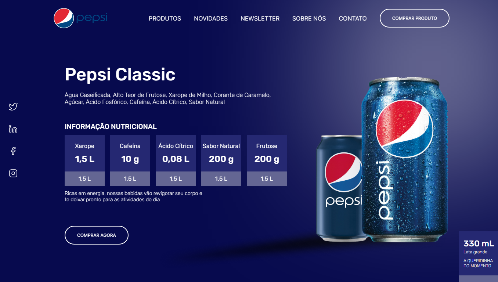

<h1 align="center"> 
    Landing-Page-LESS
</h1>

  <a href="#-About">About</a>&nbsp;&nbsp;&nbsp;|&nbsp;&nbsp;&nbsp;
  <a href="#-Project">Project</a>&nbsp;&nbsp;&nbsp;|&nbsp;&nbsp;&nbsp;
  <a href="#-Technology">Technology</a>

    

<h5 style="text-align: center"> Thank you for see !</h5>

## 📚 Sobre

Olá pessoal que curte tecnologia, estarei abordando as funcionalidade do pré-processador CSS, o **LESS**, o projeto se trata de uma versão em CSS para **LESS**, nele estarei mostrando algumas funcionalidades, como criação de **_funções_** onde definimos nossos paramêtros e atribuimos valores, com **_funções lógicas_** podemos utilizar o **_"if"_** para determinar mais de uma modificação, trabalhamos com **_importações_** de arquivos para uma melhor gestão dos arquivos, definimos **_variáveis_** que são reutilizaveis em várias partes do código, utilizamos o **_when_** e o **_when not_** para ativar uma determinada propriedade ao declarar um valor chave e também nesse projeto usamos o **_Operations_** para calcular propriedades e valores.

Para ter acesso a conteúdo similares, acesse [Senhor Programador](https://www.youtube.com/@srprogramador)

## 🚀 Technology

O projeto foi desenvolvido a partir das tecnologias:

- *HTML5*
- *LESS*

## 📚 About

Hello people who enjoy technology, I will be addressing the functionality of the CSS preprocessor, **LESS**, the project is a CSS version for **LESS**, in it I will be showing some features, such as creating ** _functions_** where we define our parameters and assign values, with **_logical functions_** we can use **_"if"_** to determine more than one modification, we work with **_importations_** of files for better management of the files, we define **_variables_** that are reusable in several parts of the code, we use **_when_** and **_when not_** to activate a certain property when declaring a key value and also in this project we use the **_Operations_** to calculate properties and values.

*To access similar content, go to [DEV envolvente](https://www.youtube.com/@devenvolvente7181)*

## 🚀 Technologies Used:

*The project was developed based on technologies:*

- *HTML5*
- *SASS*

--------------

Developed by :atom_symbol: [**Arthur Silva**]([arthursj (ArthurSilva) (github.com)](https://github.com/arthursj))
